<!-- README.md is generated from README.Rmd. Please edit that file -->

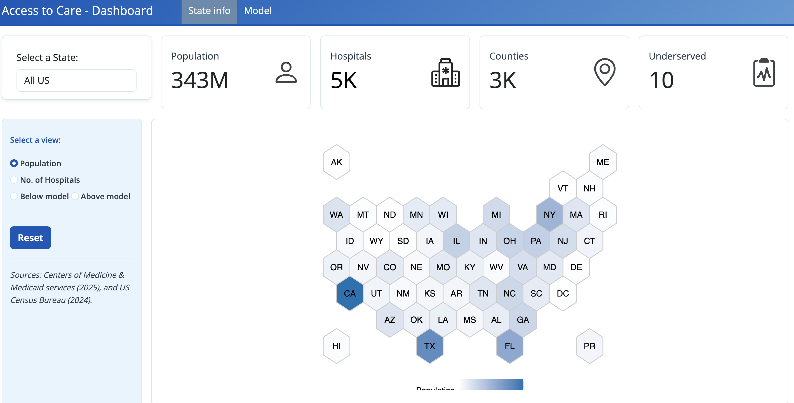

# Access to Care

This project combines US CENSUS population data with hospital data
provided by Medicare to analyze healthcare accessibility across the
United States. The analysis aims to identify counties that are
underserved or overserved in terms of hospital resources relative to
their population size. The main goal of these assets is to showcase
[Posit Connect’s](https://posit.co/products/enterprise/connect)
capabilities, such as its ability to host presentations, REST APIs,
applications, reports, and interactive content in both R and Python.

### Data Sources

- **Population Data**: 2024 US CENSUS data providing county-level
  population estimates
- **Hospital Data**: 2025 Medicare hospital facility data, including
  location and operational information

### Analysis Methodology

A linear regression model is used to establish a baseline relationship
between population size and the expected number of hospitals in a
county. This model helps identify:

- **Underserved counties**: Areas with fewer hospitals than predicted by
  the model based on their population
- **Overserved counties**: Areas with more hospitals than predicted by
  the model
- **Adequately served counties**: Areas where hospital availability
  aligns with population expectations

The model and processed data are made available through the pins
package, enabling reproducible analysis and easy integration with other
analytical workflows.

## Project Contents

This repository contains multiple implementations of the Access to Care
analysis across different formats and programming languages. All content
is deployed to [Posit Connect](https://connect.posit.com) for easy
access and interactivity.

| Thumbnail | Title | Type | Description | GitHub | Connect |
|:---|:---|:---|:---|:---|:---|
| 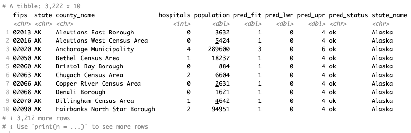 | Pins - Data | Data | County level data with the population and hospital count | [pins-data](https://github.com/sol-eng/access-to-care/tree/main/pins-data) | [View on Connect](https://connect.posit.it/access-to-care/pins-data) |
| 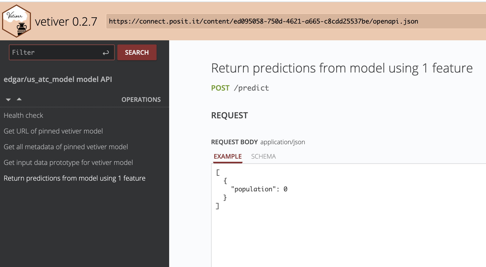 | Pins - Model | Model | Linear regression model to determine appropiate levels of hospitals based on population of a given county | [pins-model](https://github.com/sol-eng/access-to-care/tree/main/pins-model) | [View on Connect](https://connect.posit.it/access-to-care/pins-model) |
|  | REST API - R | REST API | Multiple endpoints to access the model and data, using plumber2 | [api-r](https://github.com/sol-eng/access-to-care/tree/main/api-r) | [View on Connect](https://connect.posit.it/access-to-care/api-r) |
|  | REST API - Python | REST API | REST API with multiple endpoints using FastAPI and Python | [api-python](https://github.com/sol-eng/access-to-care/tree/main/api-python) | [View on Connect](https://connect.posit.it/access-to-care/api-python) |
| 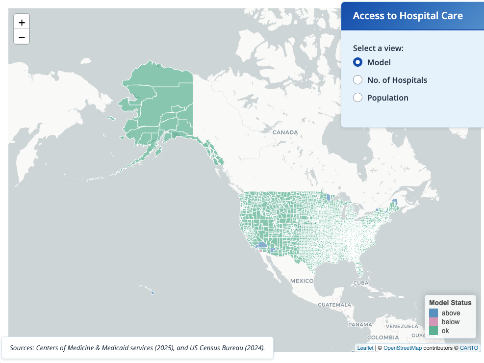 | App - R | Application | County-level data for all of the US | [app-r](https://github.com/sol-eng/access-to-care/tree/main/app-r) | [View on Connect](https://connect.posit.it/access-to-care/app-r) |
| 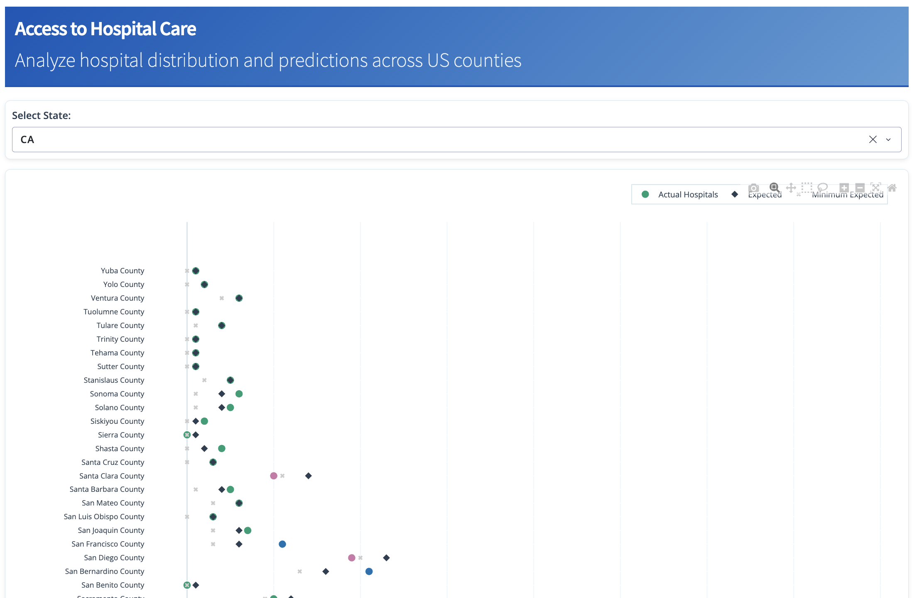 | App - Python | Dashboard | Dashboard by state using Dash | [app-python](https://github.com/sol-eng/access-to-care/tree/main/app-python) | [View on Connect](https://connect.posit.it/access-to-care/app-python) |
|  | Dashboard - R | Dashboard | Dashboard by state | [dashboard-r](https://github.com/sol-eng/access-to-care/tree/main/dashboard-r) | [View on Connect](https://connect.posit.it/access-to-care/dashboard-r) |
| 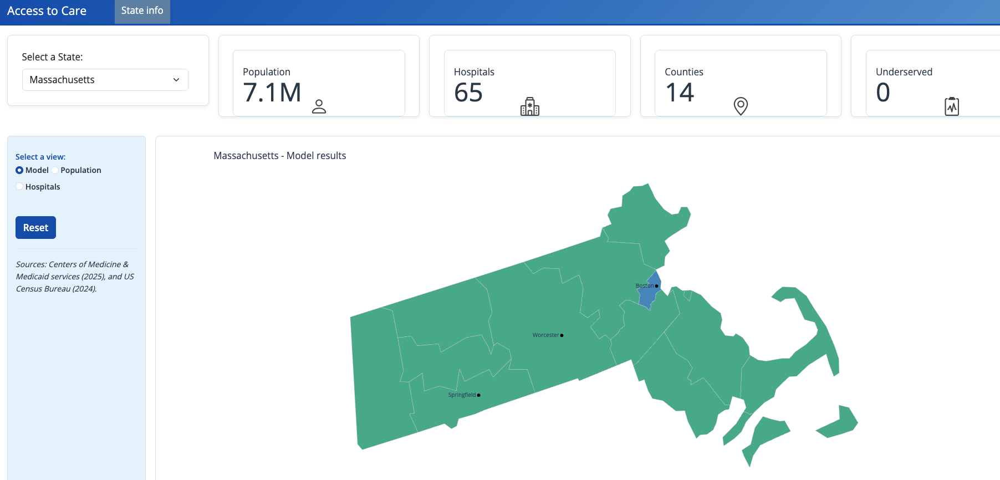 | Dashboard - Python | Dashboard | Interactive dashboard showing Access to Care data by state using Python, Polars, and Plotnine | [dashboard-python](https://github.com/sol-eng/access-to-care/tree/main/dashboard-python) | [View on Connect](https://connect.posit.it/access-to-care/dashboard-python) |
|  | Report - R | Report | Single state report with customized blastula email | [report-r](https://github.com/sol-eng/access-to-care/tree/main/report-r) | [View on Connect](https://connect.posit.it/access-to-care/report-r) |
| 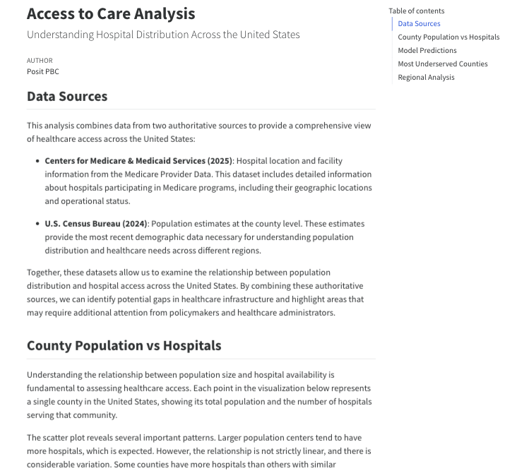 | Report - Python | Quarto HTML | HTML document showing Access to Care analysis using Python, Polars, Plotnine, and Great Tables | [report-python](https://github.com/sol-eng/access-to-care/tree/main/report-python) | [View on Connect](https://connect.posit.it/access-to-care/report-python) |
| 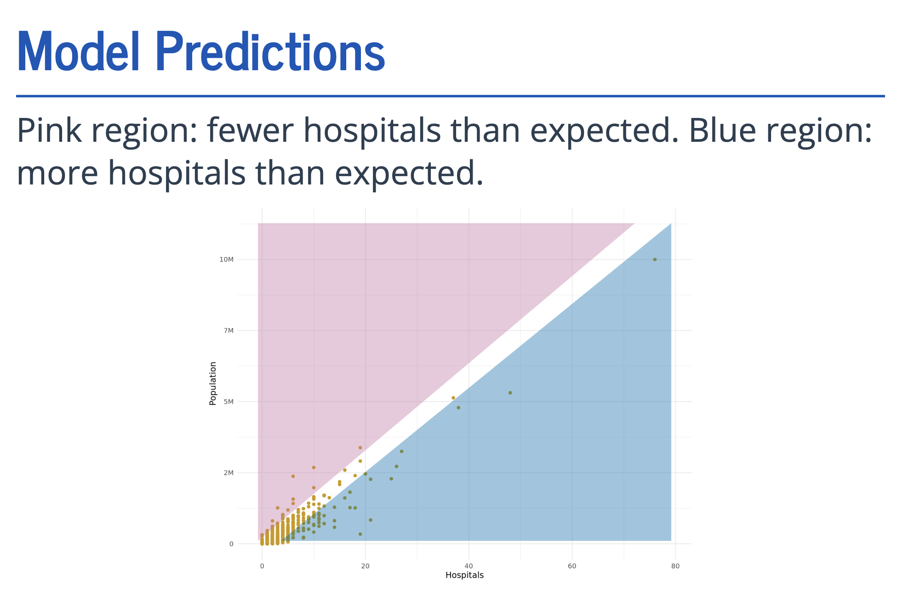 | Presentation - R | Presentation | Presentation of the data and model | [presentation-r](https://github.com/sol-eng/access-to-care/tree/main/presentation-r) | [View on Connect](https://connect.posit.it/access-to-care/presentation-r) |
| 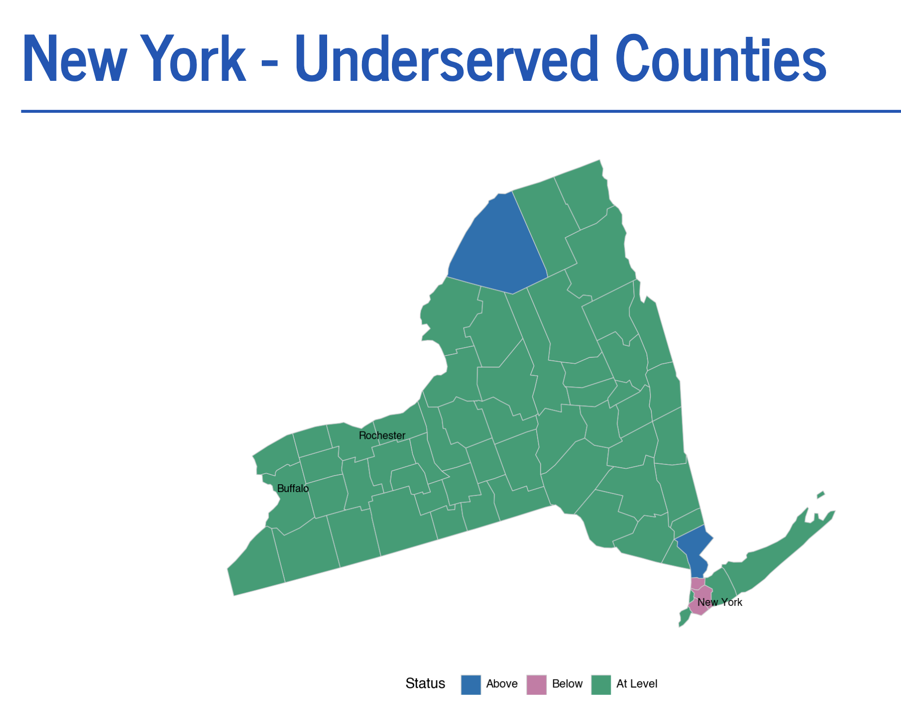 | Presentation - Python | Quarto presentation | Published version of the presentation created using Python, Polars, and Plotnine | [presentation-python](https://github.com/sol-eng/access-to-care/tree/main/presentation-python) | [View on Connect](https://connect.posit.it/access-to-care/presentation-python) |
|  | Plot - R | Plot | US Map showing the model results. Created using ggplot2 | [plot-r](https://github.com/sol-eng/access-to-care/tree/main/plot-r) | [View on Connect](https://connect.posit.it/access-to-care/plot-r) |
| 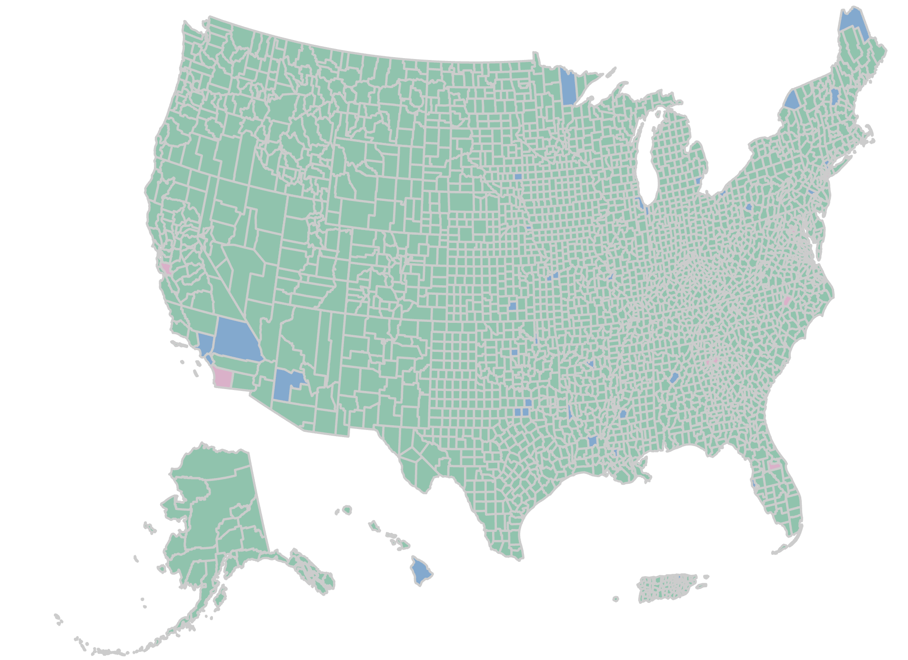 | Interactive Plot - R | Plot | Interactive US Map showing the model results, created using htmlwidget | [htmlwidgets-r](https://github.com/sol-eng/access-to-care/tree/main/htmlwidgets-r) | [View on Connect](https://connect.posit.it/access-to-care/htmlwidgets-r) |
| 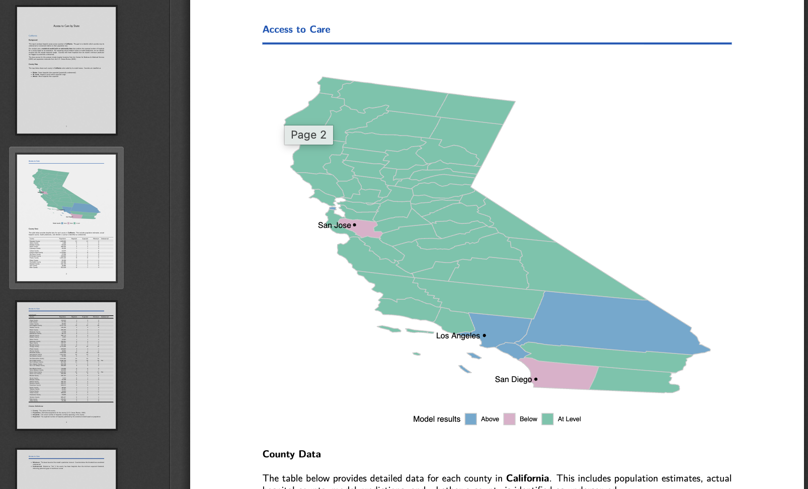 | PDF - R | Report | Single state report with a PDF output | [pdf-r](https://github.com/sol-eng/access-to-care/tree/main/pdf-r) | [View on Connect](https://connect.posit.it/access-to-care/pdf-r) |
| 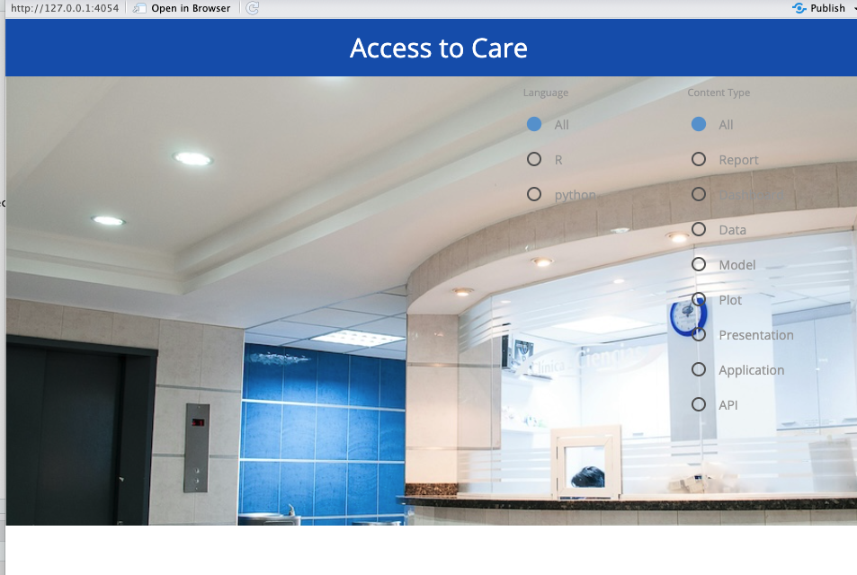 | ConnectWidgets | Application | Application that lists of all related content | [connectwidgets](https://github.com/sol-eng/access-to-care/tree/main/connectwidgets) | [View on Connect](https://connect.posit.it/access-to-care/connectwidgets) |

## Repository Structure

Each folder in this repository contains a complete, deployable
implementation:

- **pins-data** and **pins-model**: Shared data and model artifacts
  accessible via the pins package
- **api-r** and **api-python**: REST API implementations for
  programmatic access to data and predictions
- **app-r** and **app-python**: Interactive applications for exploring
  county-level data
- **dashboard-r** and **dashboard-python**: State-level dashboards with
  visualizations
- **report-r** and **report-python**: Comprehensive HTML reports with
  analysis
- **presentation-r** and **presentation-python**: Presentation-format
  outputs for sharing findings
- **plot-r** and **htmlwidgets-r**: Static and interactive visualization
  outputs
- **pdf-r**: PDF report generation for single-state analysis
- **connectwidgets**: Landing page application listing all related
  content

This project was created using the
[accesstocare](https://github.com/sol-eng/accesstocare) R package, which
provides tools for generating Access to Care analyses.

## Deploy to Your Posit Connect Instance

If you want to deploy all of these assets to your own Posit Connect
instance, you can use the programmatic deployment capabilities built
into the `accesstocare` package. This approach will replicate the entire
project structure, including all content types, custom thumbnails, and
vanity URLs, to your Connect server.

The deployment process uses Git-backed deployment, which means your
Posit Connect instance will maintain a direct connection to the
repository for ongoing synchronization and updates.

### Deployment Steps

**Step 1: Clone the repository**

``` bash
git clone https://github.com/sol-eng/access-to-care.git
cd access-to-care
```

**Step 2: Install the accesstocare package**

``` r
pak::pak("sol-eng/accesstocare")
```

**Step 3: Deploy everything to your Connect instance**

``` r
library(accesstocare)
deploy_git_backed(".")
```

The `deploy_git_backed()` function will automatically:

- Deploy all example data products to your Posit Connect instance
- Set custom thumbnails for each content item
- Establish vanity URLs for convenient access to each asset
- Configure Git-backed deployment for all compatible content types

Make sure you have your Posit Connect credentials configured (via
environment variables or RStudio Connect pane) before running the
deployment.
