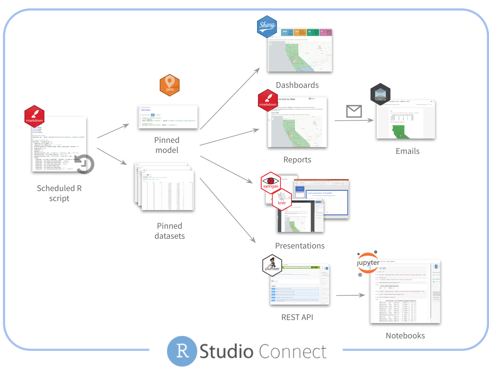

<!-- README.md is generated from README.Rmd. Please edit that file -->

# Access to Care

<!-- badges: start -->
<!-- badges: end -->

**Background:** This project combines US CENSUS population data with
hospital data provided by Medicare. A linear model is used to determine
if a county is over, or under served based on the size of the
population.

## Individual content

|  No | Type               | Content                                                                                          | Code                                                                               | Refresh     | Description                                                                |
|----:|:-------------------|:-------------------------------------------------------------------------------------------------|:-----------------------------------------------------------------------------------|:------------|:---------------------------------------------------------------------------|
|   1 | Dashboard          | [Dashboard built in Dash](https://colorado.rstudio.com/rsc/access-to-care/dash/)                 | [Code](https://github.com/sol-eng/access-to-care/tree/master/dash)                 |             | Dashboard by state                                                         |
|   2 | Dashboard          | [flexdashboard](https://colorado.rstudio.com/rsc/access-to-care/dashboard/)                      | [Code](https://github.com/sol-eng/access-to-care/tree/master/flexdashboard)        |             | Dashboard by state                                                         |
|   3 | Jupyter            | [Jupyter notebook](https://colorado.rstudio.com/rsc/access-to-care/jupyter/)                     | [Code](https://github.com/sol-eng/access-to-care/tree/master/jupyter)              |             | Published version of the Jupyter Notebook                                  |
|   4 | Launcher           | Multiple report creation                                                                         | [Code](https://github.com/sol-eng/access-to-care/tree/master/launcher-programatic) |             | Programatic use of the Launcher to create several reports at the same time |
|   5 | Notebook           | [R Notebook](https://colorado.rstudio.com/rsc/access-to-care/notebook/)                          | [Code](https://github.com/sol-eng/access-to-care/tree/master/RNotebook)            |             | Notebook with some analysis, and creation of the Tensorflow model          |
|   6 | Plot               | [Leaflet plot](https://colorado.rstudio.com/rsc/access-to-care/leaflet/)                         | [Code](https://github.com/sol-eng/access-to-care/tree/master/htmlwidgets)          |             | Stand alone leaflet plot                                                   |
|   7 | Plot               | [Full country plot](https://colorado.rstudio.com/rsc/access-to-care/plot/)                       | [Code](https://github.com/sol-eng/access-to-care/tree/master/plot)                 |             | ggplot2 plot of the entire country                                         |
|   8 | PowerPoint         | [PowerPoint Presentation](https://colorado.rstudio.com/rsc/access-to-care/powerpoint/)           | [Code](https://github.com/sol-eng/access-to-care/tree/master/powerpoint)           |             | Presentation of the data and model                                         |
|   9 | PowerPoint         | [PowerPoint Presentation by State](https://colorado.rstudio.com/rsc/access-to-care/ppt-state/)   | [Code](https://github.com/sol-eng/access-to-care/tree/master/powerpoint-state)     |             | Parameterized RMarkdown presentation per state                             |
|  10 | Presentation       | [RMarkdown Xaringan presentation](https://colorado.rstudio.com/rsc/access-to-care/presentation/) | [Code](https://github.com/sol-eng/access-to-care/tree/master/presentation)         |             | Presentation of the data and model                                         |
|  11 | Report             | [RMarkdown with Email](https://colorado.rstudio.com/rsc/access-to-care/report/)                  | [Code](https://github.com/sol-eng/access-to-care/tree/master/RMarkdown-html)       |             | Single state report with customized blastula email                         |
|  12 | Report             | [PDF by State](https://colorado.rstudio.com/rsc/access-to-care/pdf/)                             | [Code](https://github.com/sol-eng/access-to-care/tree/master/RMarkdown-pdf)        |             | Single state report with a PDF output                                      |
|  13 | Report             | [Summary page](https://colorado.rstudio.com/rsc/access-to-care/overview/)                        | [Code](https://github.com/sol-eng/access-to-care/tree/master/connectwidgets)       |             | Summary page of all related content                                        |
|  14 | REST API           | [REST API](https://colorado.rstudio.com/rsc/access-to-care/api/)                                 | [Code](https://github.com/sol-eng/access-to-care/tree/master/plumber-api)          |             | Multiple endpoints to access the model and data                            |
|  15 | Scheduled R Script | [Data preparation](https://colorado.rstudio.com/rsc/access-to-care/data-preparation/)            | [Code](https://github.com/sol-eng/access-to-care/tree/master/RMarkdown-DataPrep)   | Once a week | Scheduled data preparation script dropped inside an RMarkdown              |
