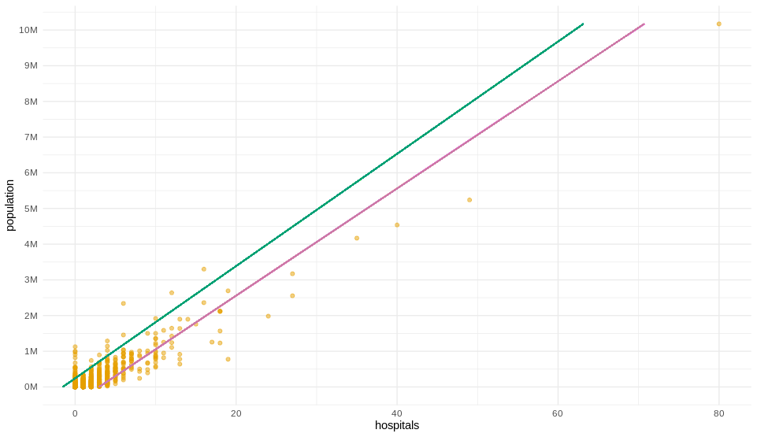

```{r setup, include=FALSE}
library(flexdashboard)
library(shiny)
library(dplyr)
library(purrr)
library(leaflet)
library(DT)
library(metricsgraphics)
library(pins)
library(connections)

if(Sys.getenv("R_CONFIG_ACTIVE") == "rsconnect") {
  boardname <- "rsconnect"
  board_register_rsconnect(
    server = Sys.getenv("connect_url"),
    key = Sys.getenv("connect_key")
    )
} else {
  boardname <- "local"
  board_register(boardname)  
}

model <- pin_get("atc-model", board = boardname)
states <- pin_get("atc-states", board = boardname) %>% collect()
```

```{r, include=FALSE}
under <- "#CC79A7"
over <- "#0072B2"
at_level <- "#008b00"
hospital_color <- "#F0E442"

state_info <- reactive({
  states %>% 
    filter(full == input$state) 
})

county_map <-  reactive({
  curr_state <- state_info() %>%
    pull(state_id)
  pin_get("atc-county-map", board = boardname) %>% 
    filter(state_id == !! curr_state) %>%
    collect()
})

base_map <- reactive({
  pin_get("atc-base-map", boardname) %>%
    filter(full %in% !! input$state) %>%
    collect()
})
```


State Info
======================================================================


Row 
-----------------------------------------------------------------------
### Options

```{r}
selectInput(
  "state","Select a State:", states$full,
  selected="California", selectize = FALSE
  )
```


### Population

```{r}
renderValueBox({
  state_info() %>%
    mutate(
      x = round(sum(population)/1000000, digits=0),
      x = paste0(x, "M")
      ) %>%
    pull() %>%
    valueBox(icon="fa-user")
    })
```

### Hospitals

```{r}
renderValueBox({
  state_info() %>%
    pull(hospitals) %>%
    valueBox(icon="fa-ambulance",color="#E69F00")
  })
```

### Counties

```{r}
renderValueBox({
  state_info() %>%
    pull(counties) %>%
    valueBox(icon="fa-map-marker",color="#009E73")
  })
```


### Underserved Counties

```{r}
renderValueBox({
  state_info() %>%
    pull(under) %>%
    valueBox(icon="fa-h-square", color="#CC79A7")
  })
```


Row {.tabset}
-----------------------------------------------------------------------

### County Map

Breakdown of counties and their status based on county population compared to the number of hospitals


```{r}
initial_map <- leaflet() %>%
  addProviderTiles(providers$CartoDB) %>%
  addLegend(
    "bottomright", 
    color  = c(under,over ,at_level, hospital_color), 
    labels = c(
      "Less hopitals than expected",
      "More hospitals than expected", "Within Range", 
      "Hospital Location"), 
    title  = "Legend",
    opacity = 0.5
    )

renderLeaflet({
  curr_state <- state_info() %>%
    pull(state_id)
  
  locations <- pin_get("atc-hospitals", board = boardname) %>%
    filter(state_id == !! curr_state) %>%
    select(longitude, latitude) %>%
    collect() %>%
    mutate_all(round, 1) %>%
    count(longitude, latitude) %>%
    mutate(popup = paste0("Hospitals: ", n))
  
  base_map() %>%
    select(popup, color, county_id) %>%
    inner_join(county_map(), by = "county_id") %>%
    group_by(county_id, shape_id) %>%
    group_map(~.x) %>%
    reduce(
      ~ addPolygons(
        .x, 
        lng = .y$long, 
        lat = .y$lat, 
        color = .y$color[[1]],
        popup = .y$popup[[1]],
        weight = 1, 
        fillOpacity = 0.3
        ), 
      .init = initial_map) %>%
      addCircleMarkers(
        lng = locations$longitude, 
        lat = locations$latitude,
        radius = 2 * (1 + log(locations$n)),
        popup = locations$popup,
        fillColor = hospital_color, color = "gray", 
        fillOpacity = 0.7,weight = 1)
})
```

### County summary


```{r}
renderDataTable({
  pin_get("atc-county-table", board = boardname)  %>%
    filter(full == !! input$state) %>%
    select(-full) %>%
    collect() %>%
    datatable(class = 'cell-border stripe')
})
```

Model {.storyboard}
======================================================================

### There was a high degree of correlation between the county's population and the number of hospitals

```{r}
renderMetricsgraphics({
  base_map() %>%
    mutate(population = round(population / 1000)) %>%
    count(population, hospitals) %>%
    mjs_plot(x=population, y=hospitals, width=600, height=500) %>%
    mjs_point() %>%
    mjs_labs(x="Population (Thousands)", y="Hospitals")
})
```

### Fitted a model to predict how many hospitals should be in a county

```{r create-plot, eval = FALSE}
bounds <- county_hospitals %>%
  summarise(mi = min(population), mx = max(population)) %>%
  as.numeric()

preds <- predict(
  model, 
  data.frame(population = bounds),
  interval = "prediction")

set.seed(100)

county_hospitals %>% 
  ggplot() +
    geom_point(aes(hospitals, population), color = "#E69F00", alpha = 0.5) +
    scale_y_continuous(breaks = 0:10 * 1000000, labels = paste0(0:10, "M")) +
    geom_segment(x = preds[1,2], y = bounds[1],
                 xend = preds[2,2], yend = bounds[2],
                 color = "#009E73") +
    geom_segment(x = preds[1,3], y = bounds[1],
                 xend = preds[2,3], yend = bounds[2],
                 color = "#CC79A7") +
    theme_minimal()
```

```{r printplot}


```


```{r}
sm <- summary(model)
```

***

The results of the model where:

- Multiple R-squared:  `r sm$r.squared`

- Adjusted ***R-squared:  `r sm$adj.r.squared` ***

And the formula was: 

- lm(formula = hospitals ~ population)


